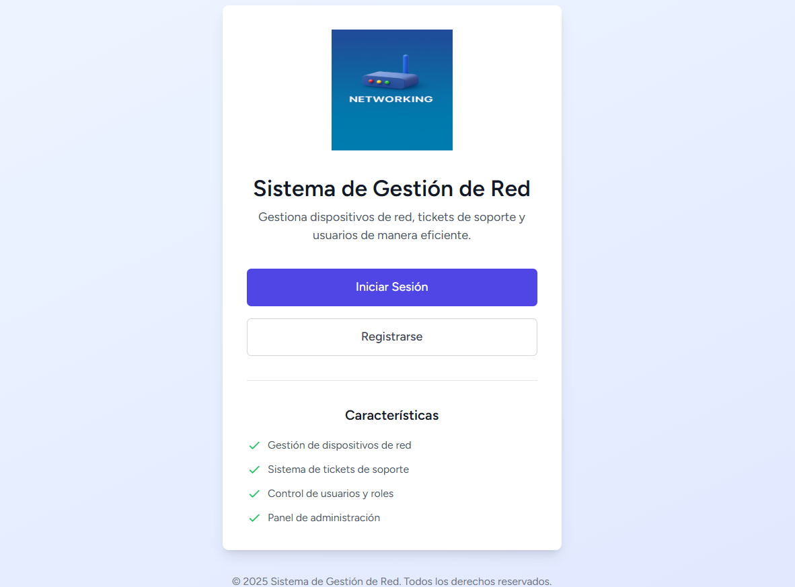
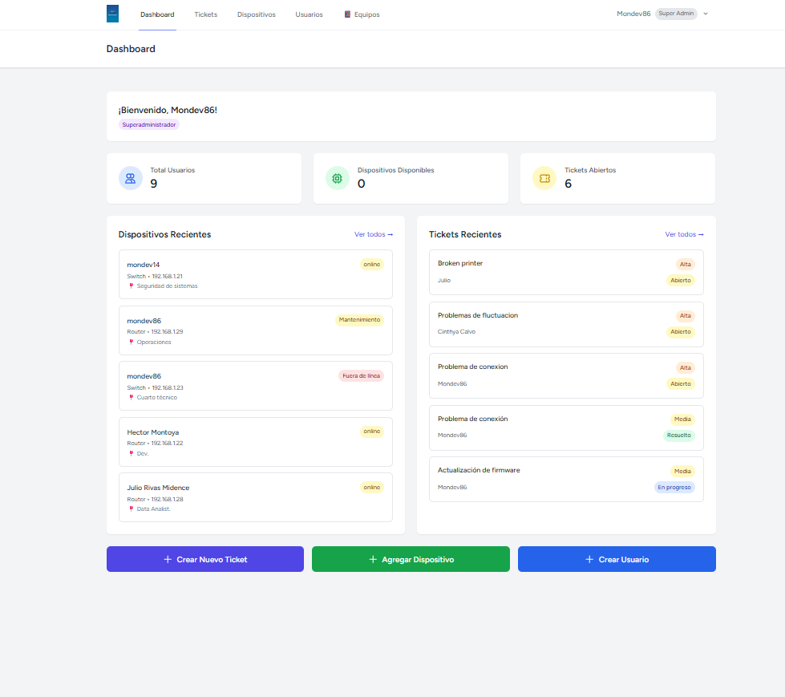
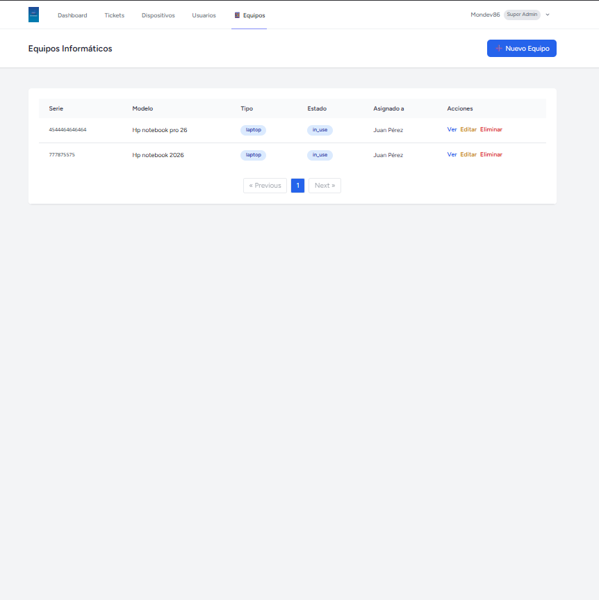

# Networking - Gestor de Dispositivos y Tickets de Soporte

Sistema web de gestión de dispositivos de red y tickets de soporte técnico construido con Laravel, Vue 3 e Inertia.js. **Dockerizado para demo rápido.**

---

## 📸 Screenshots

### Login


### Dashboard


### Módulo de Equipos


---

## 📋 Descripción

Networking es una aplicación completa para:
- **Gestionar dispositivos de red** (routers, switches, firewalls, servidores, etc.)
- **Asignar equipos informáticos** (impresoras, monitores, laptops, etc.) a usuarios o equipos de trabajo
- **Registrar y seguimiento de tickets** de soporte técnico
- **Control de usuarios** con roles (usuario, admin, superadmin)
- **Autenticación de dos factores (2FA)** para mayor seguridad
- **Dashboard personalizado** según el rol del usuario

## 🚀 Características Principales

### Dispositivos de Red
- ✅ Crear, leer, actualizar y eliminar dispositivos
- ✅ Asignar dispositivos a usuarios
- ✅ Registrar estado (online, offline, mantenimiento)
- ✅ Guardar detalles técnicos (IP, MAC, ubicación)
- ✅ Vista de dispositivos disponibles

### Asignación de Equipos Informáticos *(nuevo en v1.1.0)*
- ✅ Asignar equipos (impresoras, monitores, laptops, etc.) a usuarios o equipos
- ✅ Historial completo de asignaciones por equipo
- ✅ Control de disponibilidad en tiempo real
- ✅ Gestión por departamento o área
- ✅ Estados: disponible, asignado, en reparación
- ✅ Desasignación con registro de historial
- ✅ Vista de equipos por usuario y por equipo de trabajo

### Tickets de Soporte
- ✅ Crear tickets con descripción y prioridad
- ✅ Prioridades: baja, media, alta, urgente
- ✅ Estados: abierto, en progreso, resuelto, cerrado
- ✅ Vincular tickets a dispositivos específicos
- ✅ Respuestas y seguimiento

### Sistema de Usuarios
- ✅ Roles: Usuario, Admin, Superadmin
- ✅ Autenticación segura con Laravel Breeze
- ✅ Autenticación de dos factores (2FA) con TOTP
- ✅ Códigos de recuperación para 2FA
- ✅ Perfil de usuario personalizable
- ✅ Gestión de usuarios (solo Superadmin)

### Dashboard
- ✅ Estadísticas personalizadas por rol
- ✅ Dispositivos y equipos recientes
- ✅ Tickets recientes
- ✅ Acciones rápidas

## 🛠️ Stack Tecnológico

### Backend
- **Laravel 12** - Framework PHP
- **PHP 8.2+** - Lenguaje backend
- **MySQL 8** - Base de datos
- **Inertia.js** - Adapter frontend-backend

### Frontend
- **Vue 3** - Framework JavaScript
- **TypeScript** - Tipado estático
- **Tailwind CSS** - Estilos
- **Vite** - Bundler

### Herramientas
- **Ziggy** - Generación de rutas desde Vue
- **Laravel Telescope** - Debug y monitoreo
- **Docker + Docker Compose** - Contenedorización

## 🐳 Demo con Docker

> El proyecto está completamente dockerizado. No necesitas instalar PHP, Node ni MySQL localmente.

### Requisitos
- [Docker Desktop](https://www.docker.com/products/docker-desktop/) instalado y corriendo

### Iniciar el demo

1. **Clonar el repositorio**
```bash
git clone https://github.com/mondev86/Networking.git
cd Networking
```

2. **Levantar todos los contenedores**
```bash
docker compose up -d
```

3. **Esperar ~10 segundos** y luego configurar la aplicación
```bash
docker exec -it networking-app bash -c "php artisan migrate && php artisan optimize:clear"
```

4. **Crear usuarios de prueba**
```bash
docker exec networking-app php artisan tinker --execute='
\App\Models\User::create(["name" => "Super Admin", "email" => "superadmin@demo.com", "password" => bcrypt("password"), "role" => "superadmin"]);
\App\Models\User::create(["name" => "Admin", "email" => "admin@demo.com", "password" => bcrypt("password"), "role" => "admin"]);
\App\Models\User::create(["name" => "Usuario", "email" => "user@demo.com", "password" => bcrypt("password"), "role" => "user"]);
'
```

5. **Acceder a la aplicación**
```
http://localhost:8080
```

### Usuarios de prueba
| Rol | Email | Password |
|-----|-------|----------|
| Superadmin | superadmin@demo.com | password |
| Admin | admin@demo.com | password |
| Usuario | user@demo.com | password |

### Detener el demo
```bash
docker compose down
```

### Contenedores que se levantan
| Contenedor | Descripción | Puerto |
|------------|-------------|--------|
| `networking-app` | PHP-FPM con Laravel | - |
| `networking-nginx` | Servidor web Nginx | 8080 |
| `networking-db` | MySQL 8 | 3306 |
| `networking-node` | Node.js + Vite (dev) | 5173 |

---

## 📦 Instalación Local (sin Docker)

### Requisitos
- PHP 8.2 o superior
- Composer
- Node.js 18+ y npm
- MySQL 8.0+

### Pasos

1. **Clonar el repositorio**
```bash
git clone https://github.com/mondev86/Networking.git
cd Networking
```

2. **Instalar dependencias PHP**
```bash
composer install
```

3. **Configurar archivo .env**
```bash
cp .env.example .env
php artisan key:generate
```

4. **Configurar base de datos en .env**
```env
DB_CONNECTION=mysql
DB_HOST=127.0.0.1
DB_PORT=3306
DB_DATABASE=networking
DB_USERNAME=root
DB_PASSWORD=
```

5. **Ejecutar migraciones**
```bash
php artisan migrate
```

6. **Instalar dependencias Node y compilar**
```bash
npm install
npm run build
```

7. **Iniciar servidor**
```bash
php artisan serve
```

La aplicación estará disponible en `http://localhost:8000`

## 🔐 Roles y Permisos

| Rol | Permisos |
|-----|----------|
| **Usuario** | Ver sus dispositivos y equipos asignados, crear y gestionar sus tickets |
| **Admin** | Ver todos los dispositivos, gestionar tickets, asignar equipos a usuarios |
| **Superadmin** | Acceso total: gestión de usuarios, dispositivos, equipos y asignaciones |

## 🖥️ Módulo de Equipos Informáticos

El módulo de equipos (`/equipment`) permite gestionar el inventario de hardware de la organización y su asignación:

- **Tipos de equipo**: laptop, desktop, monitor, impresora, teclado, mouse, auriculares, tablet, teléfono, proyector, etc.
- **Asignación flexible**: un equipo puede asignarse a un usuario o a un equipo de trabajo
- **Historial**: cada asignación queda registrada con fecha de inicio y fin
- **API endpoints** para consultar historial y targets de asignación disponibles

### Rutas disponibles
```
GET    /equipment              - Listar todos los equipos
GET    /equipment/create       - Formulario de nuevo equipo
POST   /equipment              - Guardar equipo
GET    /equipment/{id}         - Ver detalle
GET    /equipment/{id}/edit    - Editar equipo
PUT    /equipment/{id}         - Actualizar
DELETE /equipment/{id}         - Eliminar
POST   /equipment/{id}/assign  - Asignar a usuario o equipo
POST   /equipment/{id}/unassign - Desasignar
GET    /equipment/user/{user}  - Equipos de un usuario
GET    /equipment/team/{team}  - Equipos de un equipo
```

## 🔒 Autenticación de Dos Factores (2FA)

### Habilitar 2FA
1. Ir a **Configuración** → **Two-Factor Authentication**
2. Hacer clic en **Enable 2FA**
3. Escanear el código QR con una app autenticadora (Google Authenticator, Authy, etc.)
4. Guardar los códigos de recuperación en lugar seguro
5. Confirmar con un código de verificación

### Códigos de Recuperación
- Se generan 8 códigos únicos al habilitar 2FA
- Cada código se puede usar una sola vez
- Guardarlos en lugar seguro

## 🗄️ Modelos de Datos

### Device (Equipos Informáticos)
```php
id, name, type, serial_number, brand, model,
status, notes, created_at, updated_at
```

### DeviceAssignment (Asignaciones)
```php
id, device_id, assignable_type, assignable_id,
assigned_at, unassigned_at, notes, created_at, updated_at
```

### NetworkDevice (Dispositivos de Red)
```php
id, name, type, ip_address, mac_address, location,
status, owner_id, created_at, updated_at
```

### Ticket
```php
id, title, description, status, priority, user_id,
device_id, assigned_to, resolved_at, created_at, updated_at
```

### User
```php
id, name, email, password, role, email_verified_at,
two_factor_secret, two_factor_recovery_codes,
created_at, updated_at
```

## 🚀 Comandos Útiles

```bash
# Ver logs en tiempo real
docker logs -f networking-app

# Limpiar caché
docker exec -it networking-app bash -c "php artisan optimize:clear"

# Correr migraciones
docker exec -it networking-app bash -c "php artisan migrate"

# Ver rutas
docker exec -it networking-app bash -c "php artisan route:list"

# Abrir tinker
docker exec networking-app php artisan tinker
```

## 🐛 Troubleshooting

### Página en blanco al cargar
- Asegúrate de que el contenedor `networking-node` esté corriendo: `docker ps`
- Revisa la consola del navegador (F12) para ver errores de JS
- Limpia el caché de Vite: `docker exec -it networking-node bash -c "rm -rf /var/www/html/node_modules/.vite" && docker restart networking-node`

### Error 500 en rutas protegidas
- Verifica que `bootstrap/app.php` tenga registrados `HandleInertiaRequests` y el alias `role`
- Corre: `docker exec -it networking-app bash -c "php artisan optimize:clear"`

### Base de datos vacía tras reiniciar
- El volumen de MySQL persiste entre reinicios. Si necesitas empezar de cero: `docker compose down -v && docker compose up -d`

### Docker lento en Windows
- Mueve el proyecto al sistema de archivos de WSL2 (`~/projects/`) en lugar de `/mnt/c/...`
- Edita siempre desde WSL con `code .` para mantener todo en el mismo sistema de archivos

### 2FA no funciona
- Verifica que la hora del sistema esté sincronizada
- Usa Google Authenticator o Authy actualizados
- Intenta con un código de recuperación

## 📄 Licencia

Este proyecto es de código abierto bajo la licencia MIT.

## 👥 Autor

Desarrollado por Hector Montoya como proyecto personal para gestionar inventario de red en entornos empresariales

---

**Versión:** 1.1.0 | **Última actualización:** 28 de febrero de 2026

### Changelog

#### v1.1.0 (2026-02-28)
- ✨ Módulo completo de asignación de equipos informáticos a usuarios y equipos
- ✨ Historial de asignaciones con fechas de inicio y fin
- ✨ Docker Compose completo para demo sin instalación local
- ✨ Autenticación de dos factores (2FA) con TOTP
- ✨ Códigos de recuperación para 2FA
- 🐛 Fix middleware `role` y `HandleInertiaRequests` en Laravel 12
- 🐛 Fix rutas de componentes Vue (case-sensitivity Linux vs Windows)
- 📝 Documentación mejorada con guía Docker detallada

#### v1.0.0 (2025-11-29)
- 🎉 Versión inicial
- ✨ Gestión de dispositivos de red
- ✨ Sistema de tickets de soporte
- ✨ Dashboard personalizado por roles
- ✨ Autenticación básica con Laravel Breeze
